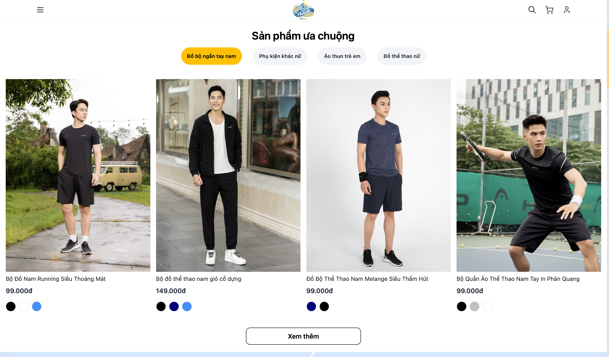
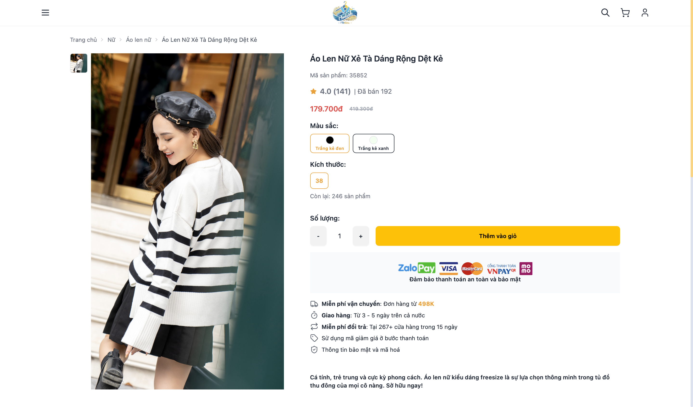
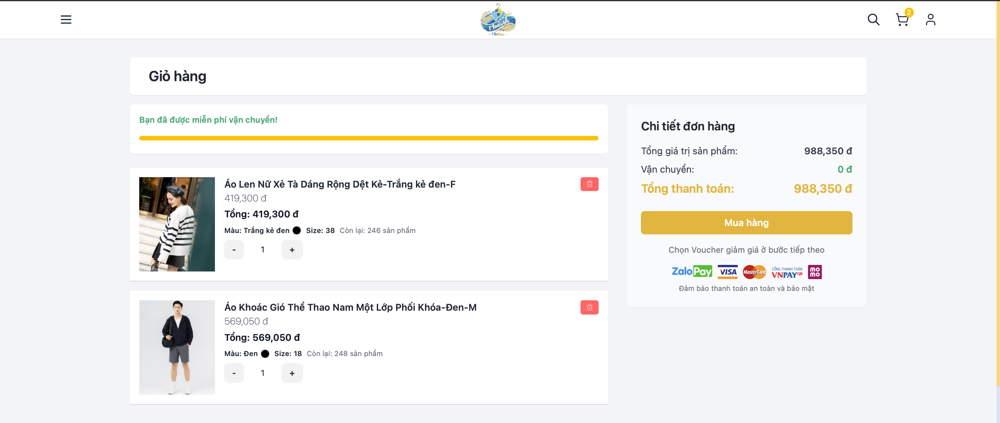
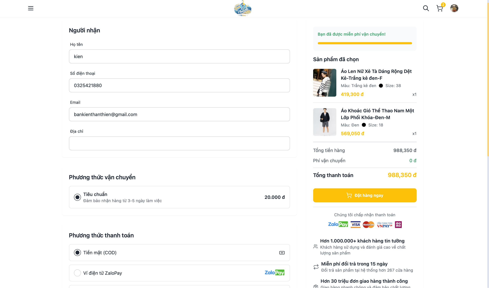
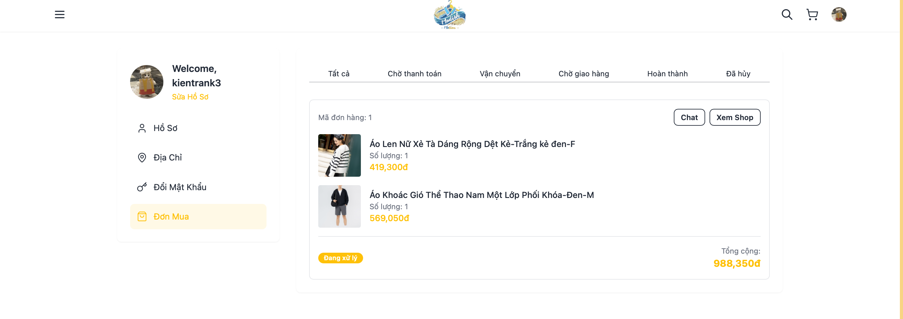

# 🛍️ Modish Motion - E-commerce Fashion Platform

## 📋 Giới thiệu

**Modish Motion** là một nền tảng thương mại điện tử chuyên về thời trang, được phát triển bằng Spring Boot với giao diện web hiện đại và đầy đủ tính năng. Ứng dụng cung cấp trải nghiệm mua sắm trực tuyến hoàn chỉnh cho người dùng và hệ thống quản lý toàn diện cho admin.

## 👥 Thành viên nhóm

| STT | Họ và tên |
|-----|-----------|
| 1 | **Trần Đình Kiên** | 
| 2 | **Nguyễn Thanh Cảnh** | 
| 3 | **Vũ Hải Nam** |
| 4 | **Hồ Thị Như Tâm** | 

## 🚀 Công nghệ sử dụng

### Backend
- **Spring Boot 3.3.4** - Framework chính
- **Spring Security** - Bảo mật và xác thực
- **Spring Data JPA** - ORM và quản lý database
- **MariaDB** - Hệ quản trị cơ sở dữ liệu
- **Thymeleaf** - Template engine
- **Spring Mail** - Gửi email
- **OAuth2** - Đăng nhập bằng Google
- **JWT** - JSON Web Token

### Frontend
- **HTML5, CSS3, JavaScript**
- **Tailwind CSS** - Framework CSS
- **Thymeleaf** - Server-side templating
- **Responsive Design** - Tương thích đa thiết bị

### Tools & Libraries
- **Maven** - Dependency management
- **Lombok** - Giảm boilerplate code
- **HikariCP** - Connection pooling
- **Logback** - Logging framework

## ✨ Tính năng chính


### 👤 Quản lý người dùng
- **Đăng ký/Đăng nhập** với tài khoản local
- **Đăng nhập bằng Google** (OAuth2)
- **Quản lý thông tin cá nhân** (profile, địa chỉ, số điện thoại)
- **Phân quyền người dùng** (Admin/User)
- **Remember me** - Ghi nhớ đăng nhập

### 🛍️ Mua sắm
- **Trang chủ** với banner và sản phẩm nổi bật
- **Danh mục sản phẩm** đa dạng
- **Tìm kiếm và lọc** sản phẩm theo nhiều tiêu chí
- **Chi tiết sản phẩm** với hình ảnh, thông tin đầy đủ
- **Giỏ hàng** với tính năng thêm/xóa/cập nhật số lượng
- **Thanh toán** với nhiều phương thức (Visa, Mastercard, MoMo)
- **Xác nhận đơn hàng** qua email
### 🏠 Trang chủ

### 🛍️ Tìm kiếm và danh mục

### 📱 Chi tiết sản phẩm

*Trang chi tiết sản phẩm với thông tin đầy đủ*
### 🛒 Quản lý giỏ hàng
- Thêm sản phẩm vào giỏ hàng
- Cập nhật số lượng sản phẩm
- Xóa sản phẩm khỏi giỏ hàng
- Tính tổng tiền tự động
- Lưu trữ giỏ hàng trong session
### 🛒 Giỏ hàng

### 📦 Quản lý đơn hàng
- **Tạo đơn hàng** từ giỏ hàng
- **Xác nhận đơn hàng** qua email
- **Theo dõi trạng thái** đơn hàng
- **Lịch sử đơn hàng** của người dùng
- **Quản lý đơn hàng** cho admin

### 📦 Đặt hàng


### 👨‍💼 Quản lý đơn hàng (Admin)

### 🎨 Giao diện người dùng
- **Responsive design** - Tương thích mobile, tablet, desktop
- **Giao diện hiện đại** với Tailwind CSS
- **Banner slider** trên trang chủ
- **Grid layout** cho danh sách sản phẩm
- **Modal popup** cho chi tiết sản phẩm
- **Loading states** và animations

### 🔐 Đăng nhập

### 🔐 Bảo mật
- **Spring Security** với authentication và authorization
- **BCrypt** mã hóa mật khẩu
- **CSRF protection**
- **Session management**
- **Role-based access control**

### 📧 Email Service
- **Xác nhận đơn hàng** tự động
- **Template email** HTML đẹp mắt
- **SMTP configuration** với Gmail
- **Error handling** cho email service

### 👨‍💼 Admin Panel
- **Dashboard** tổng quan
- **Quản lý sản phẩm** (CRUD operations)
- **Quản lý danh mục** sản phẩm
- **Quản lý người dùng** và phân quyền
- **Quản lý đơn hàng** và trạng thái
- **Thống kê** bán hàng

### 🔍 Tìm kiếm và lọc
- **Tìm kiếm theo tên** sản phẩm
- **Lọc theo danh mục**
- **Lọc theo giá**
- **Lọc theo màu sắc**
- **Lọc theo kích thước**
- **Sắp xếp** theo giá, tên, ngày

## 🗄️ Cấu trúc cơ sở dữ liệu

### Các entity chính:
- **Account** - Tài khoản người dùng
- **User** - Thông tin cá nhân
- **Item** - Sản phẩm
- **Category** - Danh mục sản phẩm
- **Variant** - Biến thể sản phẩm (màu sắc, kích thước)
- **Color** - Màu sắc
- **Size** - Kích thước
- **Order** - Đơn hàng
- **OrderDetail** - Chi tiết đơn hàng

## 🚀 Hướng dẫn cài đặt và chạy

### Yêu cầu hệ thống
- Java 21+
- Maven 3.6+
- MariaDB 10.5+
- IDE (IntelliJ IDEA, Eclipse, VS Code)

### Cài đặt

1. **Clone repository**
```bash
git clone [repository-url]
cd modish-motion
```

2. **Cấu hình database**
- Tạo database MariaDB: `modish_motion`
- Cập nhật thông tin kết nối trong `application.properties`

3. **Cấu hình email**
- Cập nhật thông tin SMTP trong `application.properties`
- Sử dụng Gmail App Password

4. **Build và chạy**
```bash
mvn clean install
mvn spring-boot:run
```

5. **Truy cập ứng dụng**
- Frontend: http://localhost:8080
- Admin: http://localhost:8080/admin

## 📁 Cấu trúc project

```
modish-motion/
├── src/main/java/fit/iuh/modish_motion/
│   ├── configs/          # Cấu hình Spring Security, Web
│   ├── controllers/      # Controllers xử lý request
│   ├── dto/             # Data Transfer Objects
│   ├── entities/        # JPA Entities
│   ├── enums/           # Enumerations
│   ├── exception/       # Custom exceptions
│   ├── repositories/    # Data access layer
│   ├── services/        # Business logic interfaces
│   └── servicesImpl/    # Business logic implementations
├── src/main/resources/
│   ├── static/          # CSS, JS, Images
│   ├── templates/       # Thymeleaf templates
│   └── application.properties
└── pom.xml
```

## 🎯 Tính năng nổi bật

### 🛒 Trải nghiệm mua sắm
- Giao diện thân thiện, dễ sử dụng
- Tìm kiếm và lọc sản phẩm nhanh chóng
- Giỏ hàng thông minh với tính năng real-time
- Thanh toán an toàn với nhiều phương thức

### 🔐 Bảo mật cao
- Xác thực đa lớp với Spring Security
- Mã hóa mật khẩu với BCrypt
- Phân quyền chi tiết cho admin và user
- Bảo vệ CSRF và session hijacking

### 📧 Thông báo tự động
- Email xác nhận đơn hàng
- Template email HTML chuyên nghiệp
- Xử lý lỗi email gracefully

### 📊 Quản lý toàn diện
- Dashboard admin với thống kê
- CRUD operations cho tất cả entities
- Quản lý đơn hàng và người dùng
- Giao diện admin responsive


## 📄 License

Project này được phát triển cho mục đích học tập và nghiên cứu.

## 📞 Liên hệ

- **Email**: kientran0705@gmail.com or thanhcanh.dev@gmail.com
